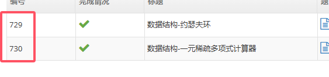

# xdoj部分题目的AC源码

## 简述

这里的大部分是xdoj题目的满分源码。

**如果显示错误，请换成GNU编译器再试；如果仍然不行，请联系作者删除。**

## 查找方式

找到题目的题号，如下图所示

然后查找该仓库中有没有对应的文件。
由于该文件只有作者写过的xdoj，没有的话也是正常的事。有意增添题目AC源码的也可找作者联系。

## 好菜~~

别骂了 **(╯‵□′)╯︵┻━┻**
